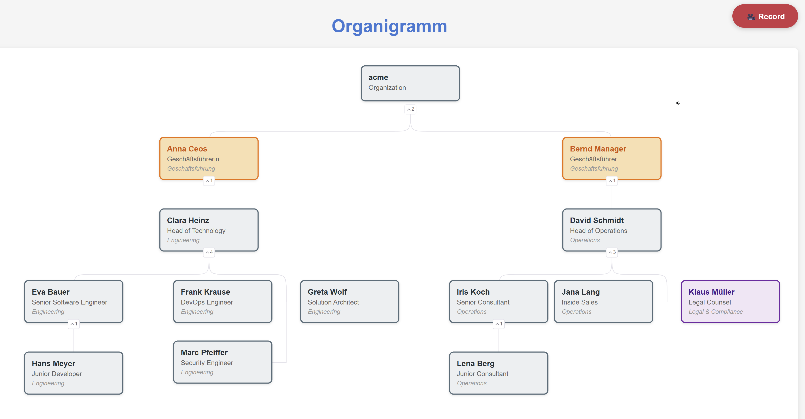

# Digital Business Cards

Generate QR codes for digital business cards from your company directory — supports Azure AD/Entra and LDAP/Active Directory.



> See [\_docs/examples.md](_docs/examples.md) for screenshots, a demo recording, and diagram examples (Mermaid/PlantUML).
>
> For a comparison with SharePoint/SPFx org chart solutions, see [\_docs/orgchart-alternatives.md](_docs/orgchart-alternatives.md).

## Features

- 🔄 Sync contacts from **Azure AD/Entra** or **LDAP/Active Directory**
- 📇 Generate vCard (VCF) files with contact details
- 📱 Create QR codes containing vCard data
- 📊 Generate interactive org charts (HTML, Mermaid, PlantUML)
- 🎯 Batch generation or individual cards
- 🖼️ Export as PNG or SVG

## Quick Start

```bash
# Install uv: https://docs.astral.sh/uv/getting-started/installation/

# First-time Azure login
az login

# Sync contacts from Azure AD
uv run dbc sync

# Generate all QR codes
uv run dbc generate-all

# Generate single card
uv run dbc generate MKo
```

> **Recommended**: Use `uv` for automatic dependency management and virtual environment handling.
> Alternatively, you can use `pip install -e .` and run `dbc` directly.

## Commands

### Sync from Azure AD

```bash
uv run dbc sync
uv run dbc sync --department "Engineering"

# Interactive browser auth (first-time)
uv run dbc sync --interactive

# Preview without saving
uv run dbc sync --dry-run
```

**LDAP / Active Directory**:

Configure via environment variables (see [`.env.ldap.example`](.env.ldap.example)):

```bash
export LDAP_URL=ldap://dc.example.com
export LDAP_BIND_DN="CN=svc-dbc,OU=ServiceAccounts,DC=example,DC=com"
export LDAP_BIND_PASSWORD=secret
export LDAP_BASE_DN="DC=example,DC=com"

uv run dbc sync --source ldap
uv run dbc sync --source ldap --department "Engineering"
uv run dbc sync --source ldap --dry-run
```

For a local demo with mock data:

```bash
docker compose -f docker-compose.ldap.yml up -d   # start OpenLDAP with 13 mock contacts
uv run dbc sync --source ldap --dry-run
```

See [\_docs/sync-sources.md](_docs/sync-sources.md) for full documentation of all sync options.

### Generate QR Codes

```bash
uv run dbc generate-all
uv run dbc generate-all --output ./cards --format svg --size 512
uv run dbc generate MKo
```

### List Contacts

```bash
uv run dbc list
uv run dbc list --verbose
```

### Organization Chart

```bash
uv run dbc orgchart                              # interactive HTML (default)
uv run dbc orgchart -o org.html                  # save to file
uv run dbc orgchart --format mermaid -o org.md   # Mermaid
uv run dbc orgchart --format puml -o org.puml    # PlantUML
uv run dbc orgchart --department "Engineering"
uv run dbc orgchart --root MKo
```

## Output

```
data/
├── contacts.csv        # Synced from Azure AD
└── output/
    ├── MKo.vcf         # vCard files
    └── MKo.png         # QR codes
```

## Requirements

- Python 3.11+
- Azure CLI (`az login` for authentication)
- Azure AD read permissions

## Ideas & Potential Extensions

See [\_docs/roadmap.md](_docs/roadmap.md) for planned and potential features (avatars, server mode, presence status, vCard 4.0, PDF export, multi-source merge, CI integration).

## License

MIT License - see [LICENSE](LICENSE)
