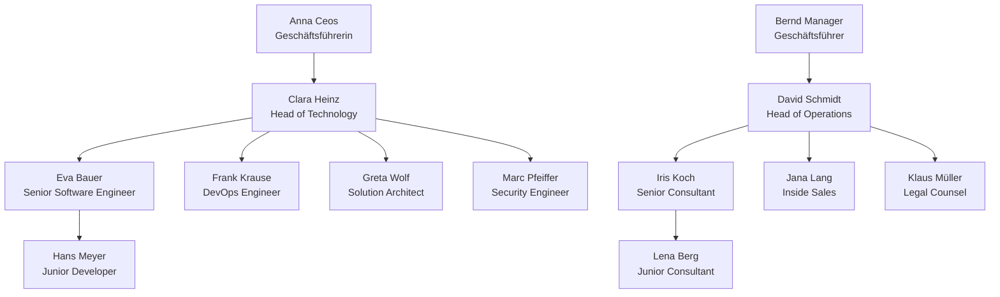
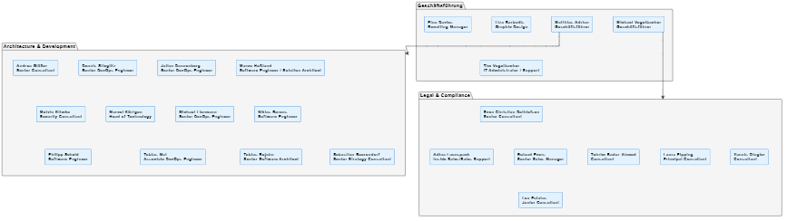

# Examples

All examples use the included mock dataset (`data/contacts.mock.csv`) — fully fictional contacts,
company `acme`, phone numbers `+49 (800) 000-xxxx`, emails with `.example` domain.

## Mock Dataset

```csv
id,name,email,title,department,...
ACe,Anna Ceos,anna.ceos@acme-gmbh.example,Geschäftsführerin,Management,...
BMa,Bernd Manager,bernd.manager@acme-gmbh.example,Geschäftsführer,Operations,...
CHe,Clara Heinz,clara.heinz@acme-gmbh.example,Head of Technology,Engineering,...
...
```

Generate it yourself (no Azure login needed):

```bash
# Org chart (interactive HTML)
uv run dbc.py orgchart --contacts data/contacts.mock.csv -o data/orgchart.mock.html

# Business cards for all mock contacts
uv run dbc.py generate-all --contacts data/contacts.mock.csv --output data/output-mock

# Mermaid diagram
uv run dbc.py orgchart --contacts data/contacts.mock.csv --format mermaid -o _docs/orgchart.mock.md

# PlantUML diagram
uv run dbc.py orgchart --contacts data/contacts.mock.csv --format puml -o _docs/orgchart.mock.puml
```

---

## Business Card — QR Code

Contact: **Clara Heinz** · Head of Technology · Engineering


The QR code encodes a vCard (VCF) that can be scanned with any smartphone camera to add the contact directly.

### vCard (VCF)

```vcf
BEGIN:VCARD
VERSION:3.0
FN:Clara Heinz
N:Heinz;Clara;;;
TITLE:Head of Technology
ORG:acme
TEL;TYPE=WORK:+49 (800) 000-0010
TEL;TYPE=CELL:+49 (151) 000-0010
EMAIL;TYPE=INTERNET:clara.heinz@acme-gmbh.example
NOTE:Department: Engineering
END:VCARD
```

---

## Organization Chart — Interactive HTML


> Open `data/orgchart.mock.html` in any browser for the full interactive version.  
> Demo recording (11s): [orgchart.webm](orgchart.webm)

Features:

- Zoom & pan, collapse/expand nodes
- Color-coded by department
- Built-in screen recording button (exports `.webm`)

---

## Organization Chart — Mermaid

Renders natively on GitHub, GitLab, VS Code, Obsidian, etc.



---

## Organization Chart — PlantUML

> Render with PlantUML CLI, [plantuml.com](https://www.plantuml.com/plantuml/uml/), or the VS Code extension [jebbs.plantuml](https://marketplace.visualstudio.com/items?itemName=jebbs.plantuml).



> See [orgchart.mock.puml](orgchart.mock.puml) for the full source.
