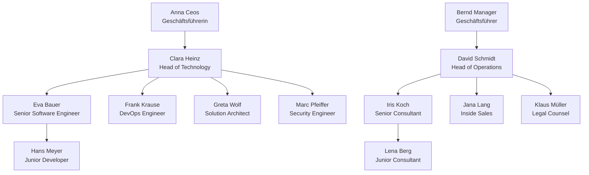

# Org Chart

```mermaid
graph TD
    ACe["Anna Ceos\nGeschäftsführerin"]
    BMa["Bernd Manager\nGeschäftsführer"]
    CHe["Clara Heinz\nHead of Technology"]
    ACe --> CHe
    DSc["David Schmidt\nHead of Operations"]
    BMa --> DSc
    EBa["Eva Bauer\nSenior Software Engineer"]
    CHe --> EBa
    FKr["Frank Krause\nDevOps Engineer"]
    CHe --> FKr
    GWo["Greta Wolf\nSolution Architect"]
    CHe --> GWo
    HMe["Hans Meyer\nJunior Developer"]
    EBa --> HMe
    IKo["Iris Koch\nSenior Consultant"]
    DSc --> IKo
    JLa["Jana Lang\nInside Sales"]
    DSc --> JLa
    KMu["Klaus Müller\nLegal Counsel"]
    DSc --> KMu
    LBe["Lena Berg\nJunior Consultant"]
    IKo --> LBe
    MPf["Marc Pfeiffer\nSecurity Engineer"]
    CHe --> MPf
```
